<!-- <div style="width: 830px"> -->

# X-Suite starter pack
As described on [x-suite website](https://xsuite.readthedocs.io/en/latest/):  
*Xsuite is a collection python packages for the simulation of the beam dynamics in particle accelerators.*

This repo is a collection of mostly pre-existing examples developed to practice with this new tool.  
When possible, I will point to the link of the original example/repo.

## Table of content
- [Install X-Suite or get a Docker](#install-x-suite) 
- [First working example](#first-working-example)
- [Describe a Line](#describe-a-line)
- [Build a ring](#build-a-ring)
- [Acceleration](#Acceleration)
- [Twiss](#twiss)

## Install X-Suite
X-Suite can be easily installed via `pip` but in case you prefer I have a dockerfile you can use.

For more information on Docker usage with Xsuite, visit [this Docker repository](https://github.com/b-vitali/Dockers).

This docker has some minimal tweeking to have a functioning jupyter notebook and other small things.  
Most of the requirements for additional tools (MAD-X, Sixtracktools, PyHEADTAIL, ...) are already installed.

## First working example
This code simulates the tracking of particles through a simple lattice using the x-suite library.  
The purpose is to visualize the evolution in phase space \( x, px \) of a particle over multiple turns.

> [!NOTE]
> The corresponding file is [basic_example.py](basic_example.py)
> 
> This is based on : https://xsuite.readthedocs.io/en/latest/singlepart.html

<details>
<summary>Click here to see more!</summary>

### Code Overview
The code is hevely commented so here I will just outline the steps, which are similar in every simulation
- Generate a *Line*
- Attach a reference particle
- Define on what the simulation will be running (CPU/GPU)
- Compute the *Twiss parameters*
- Simulate the particles for N turns
- Collect and plot the results

Collecting the tracking information at every turn we can follow the evolution in \( x, px \):
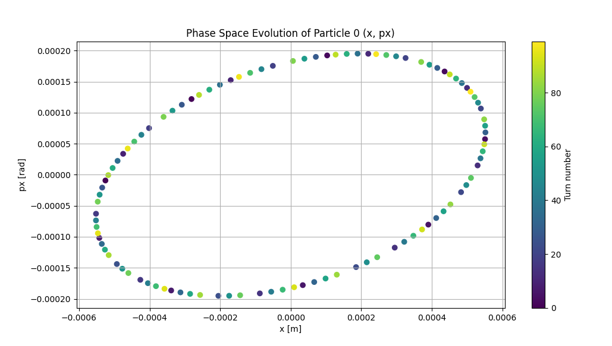

</details>


## Describe a Line
Clearly the first important step is to understand how to describe the beamline we wish to study.  
Here we will see how to define, inspect, manipulate, and save/load a beamline model using the `xtrack`.

> [!NOTE]
> The corresponding file is [line_example.py](line_example/line_example.py)
> 
> This is based on : https://xsuite.readthedocs.io/en/latest/line.html

> [!CAUTION]
> For whatever reason describing the line as `xt.Line` makes so `line.survey().plot()` doesn't work
> 
> I'm investigating what is going on

<details>
<summary>Click here to see more!</summary>

### Defining a Line
A line can be defined in several ways:
- **Manually**: Create individual beamline elements (`Quadrupole`, `Drift`, `Bend`) and adding them to the line.
- **Importing from MAD-X**: Use `xt.Line.from_madx_sequence()` to import a line from a MAD-X file.
- **Using a Sequence**: Define the line through element positions and properties.

The line define manually in this example is shown here
```
pi = np.pi
lbend = 3
lquad = 0.3
elements = {
    'mqf.1': xt.Quadrupole(length=lquad, k1=0.1),
    'd1.1':  xt.Drift(length=1),
    'mb1.1': xt.Bend(length=lbend, k0=pi / 2 / lbend, h=pi / 2 / lbend),
    'd2.1':  xt.Drift(length=1),

    'mqd.1': xt.Quadrupole(length=lquad, k1=-0.7),
    'd3.1':  xt.Drift(length=1),
    'mb2.1': xt.Bend(length=lbend, k0=pi / 2 / lbend, h=pi / 2 / lbend),
    'd4.1':  xt.Drift(length=1),

    ...
}
```
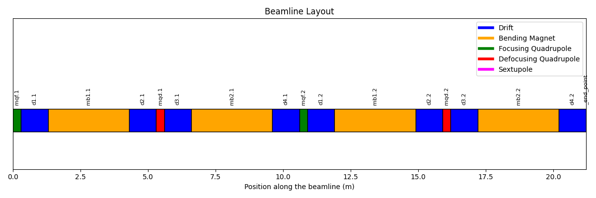

### Inspecting a Line
`xtrack` provides methods to inspect line properties:
- **Element names**: Retrieve all the names of elements in the line (`line.element_names`).
- **Element objects**: Retrieve the actual element objects (`line.elements`).
- **Attributes extraction**: Extract specific attributes (e.g., length) across all elements (`line.attr['length']`).
- **Table view**: Generate a detailed table with information about each element (`line.get_table()`).

### Controlling Element Properties Using Variables
Variables and expressions can be used to control properties of elements:
- **Creating Variables**: Variables (`line.vars`) are created to control the integrated strengths (`k1l`) of quadrupoles.
- **Associating Variables with Elements**: Variables are linked to elements using references (`line.element_refs`). This allows changes in variables to automatically propagate to the corresponding element properties.
- **Global Variables**: Global variables (`line.vars['k1lf']` and `line.vars['k1ld']`) can be defined to control multiple quadrupoles simultaneously.

### Creating and Using Expressions
Expressions can be built using variables to create complex relationships:
- Variables can be combined using mathematical operations.
- Expressions update automatically when their dependencies change, maintaining consistency in the model.

### Saving and Loading a Line
`xtrack` allows saving a line to a JSON file or a dictionary:
- **Saving to JSON**:
    ```python
    line.to_json('line.json')
    ```

- **Loading from JSON**:
    ```python
    line_2 = xt.Line.from_json('line.json')
    ```

You can also save additional information within the dictionary:
```
dct = line.to_dict()
dct['my_additional_info'] = 'Some important information about this line I created'
with open('line.json', 'w') as fid:
    json.dump(dct, fid, cls=xo.JEncoder)

# Loading back
with open('line.json', 'r') as fid:
    loaded_dct = json.load(fid)
line_2 = xt.Line.from_dict(loaded_dct)
print(loaded_dct['my_additional_info'])
```

### Adding elements
Taking the previous *line*, we can add sextupoles right after the quadrupoles via `line.insert_element()`
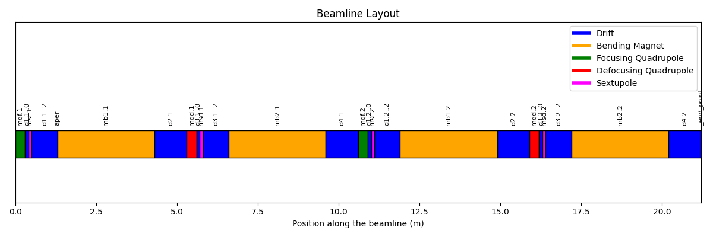

### Slicing
To improve the simulation it is quite common to *slice* the elements in smaller chunks
This can be done in various ways using different `slicing_strategies`
```
line.slice_thick_elements(
    slicing_strategies=[
        # Slicing with thin elements
        xt.Strategy(slicing=xt.Teapot(1)),                              # Default applied to all elements
        xt.Strategy(slicing=xt.Uniform(2), element_type=xt.Bend),       # Selection by element type
        xt.Strategy(slicing=xt.Teapot(3), element_type=xt.Quadrupole),  # Selection by element type
        xt.Strategy(slicing=xt.Teapot(4), name='mb1.*'),                # Selection by name pattern
        # Slicing with thick elements
        xt.Strategy(slicing=xt.Uniform(2, mode='thick'), name='mqf.*'), # Selection by name pattern
        # Do not slice (leave untouched)
        xt.Strategy(slicing=None, name='mqd.1') # (7) Selection by name
    ])
```
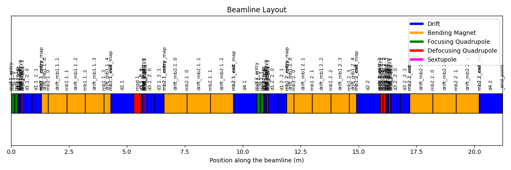

</details>

## Build a ring

Let's now try and build a proper ring, matched and with FODO structure.  
Once this is done we can add an insertion for an *experiment*.

> [!NOTE]
> The corresponding file is [ring.py](ring/ring.py)
> 
> This is based on : https://github.com/xsuite/tutorial_lattice_design/blob/main/notebook_00_ring.ipynb

<details>
<summary>Click here to see more!</summary>

### Build a FODO 

First step is defining the variables and the magnets and mount them in a *half cell*.

To make it a full FODO is then it's quite simple, mirroring the half cell.
```
# Define the full cell by mirroring the half-cell
cell = env.new_line(components=[
    env.new('start', xt.Marker),  # Start marker
    -halfcell,                    # Mirror the first half of the cell
    halfcell,                     # Add the second half of the cell
    env.new('end', xt.Marker),    # End marker
])
```

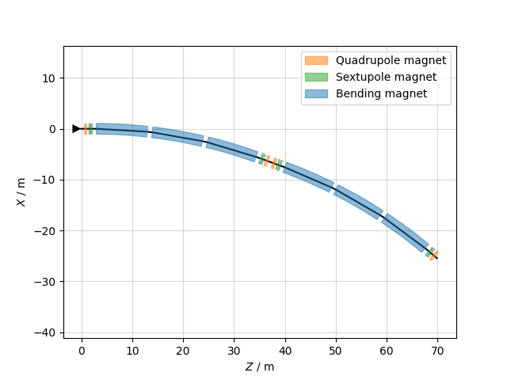

At this point we can *match* and see the resulting *twiss*
```
# Perform phase advance matching (setting the tunes to specific values)
opt = cell.match(
    solve=False,  # Do not solve immediately; we'll inspect before solving
    method='4d',  # 4D matching method
    vary=xt.VaryList(['kqf', 'kqd'], step=1e-5),  # Vary the strengths of the focusing and defocusing quadrupoles
    targets=xt.TargetSet(
        qx=0.333333,  # Target horizontal tune (fractional part of betatron oscillation)
        qy=0.333333,  # Target vertical tune
    ))
```

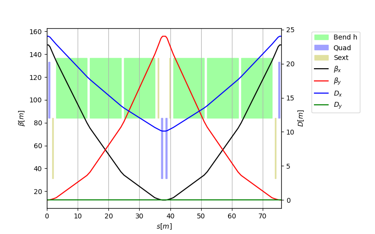


### Make a ring

We first define a *half straight section* and build with it a *whole straight section*

Then we can mount multiple FODO and straight sections in a *full ring* with some math

```
# Assemble a ring
arc = 3 * cell
straight_section = 2*cell_ss
ring = 3 * (arc + straight_section)
ring.survey().plot()
```

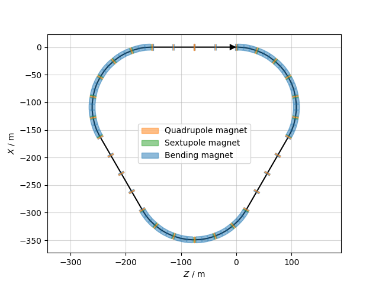
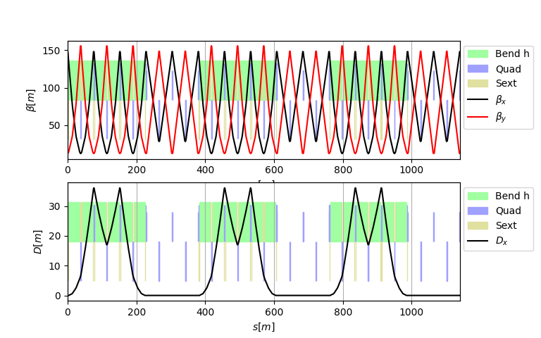

### Create an insertion

We want now to make some space in this ring for an experiment

We first define a region of 40m with round beta functions

Create a *half section* and match the optics to the FODO

The last step it to make a *whole section* and build the ring

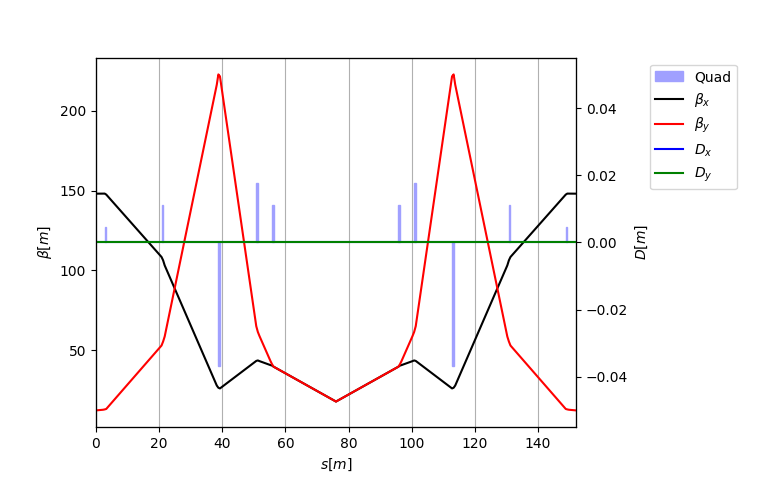

### Finished lattice

We place the insertion with `ring_2 = 2 * (arc + straight_section) + arc + insertion`

Now we can finally see our results!

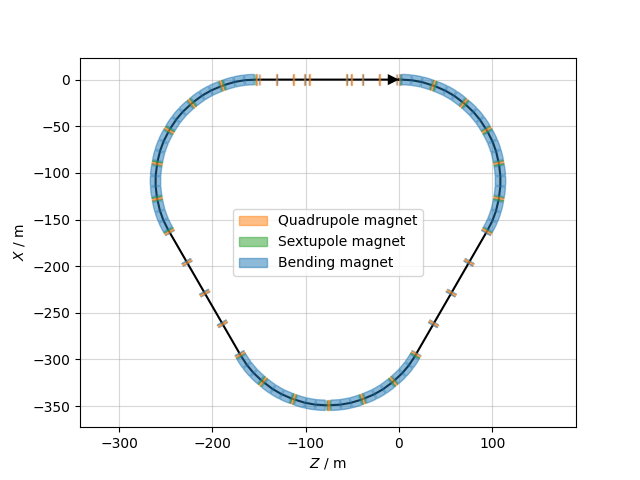

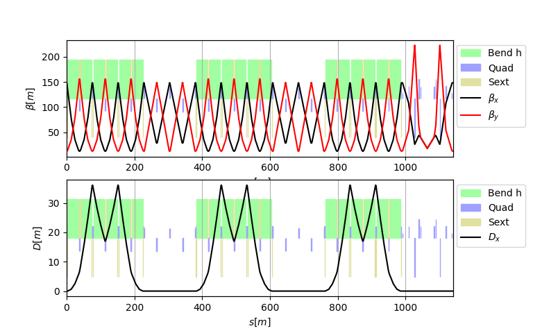

</details>

## Acceleration
Let's see what happens when we rump up the energy of the particles

> [!NOTE]
> The corresponding file is [acceleration.py](acceleration/acceleration.py)
> 
> This is based on : https://github.com/xsuite/xtrack/blob/main/examples/acceleration/001_energy_ramp.py

<details>
<summary>Click here to see more!</summary>

### Line and intended ramp-up

We start by importing a pre-existing beamline [acceleration_line.json](acceleration/acceleration_line.json)

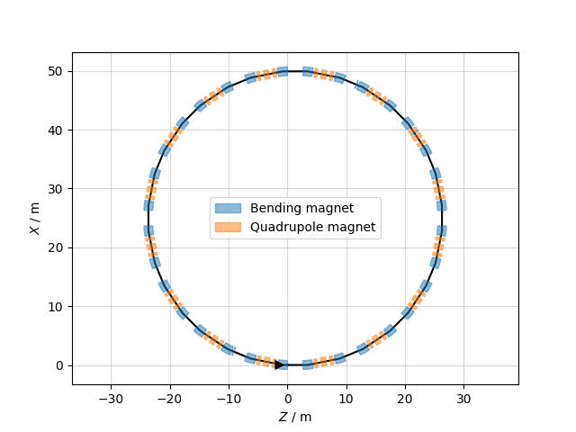


We then define how we want to ramp-up the energy

```
# User-defined energy ramp: time values [s] and corresponding kinetic energies [GeV]
t_s = np.array([0., 0.0006, 0.0008, 0.001 , 0.0012, 0.0014, 0.0016, 0.0018,
                0.002 , 0.0022, 0.0024, 0.0026, 0.0028, 0.003, 0.01])

E_kin_GeV = np.array([0.16000000,0.16000000,
    0.16000437, 0.16001673, 0.16003748, 0.16006596, 0.16010243, 0.16014637,
    0.16019791, 0.16025666, 0.16032262, 0.16039552, 0.16047524, 0.16056165,
    0.163586])

# Attach the energy program to the line to define how the kinetic energy evolves over time
line.energy_program = xt.EnergyProgram(
    t_s=t_s,                            # Array of time points [s]
    kinetic_energy0=E_kin_GeV * 1e9     # Corresponding kinetic energies [eV]
)
```

### Propagate the ramp-up to the elements

Now we need to tell te elements in the line to follow the ramp-up we created

```

# Setup the RF cavity frequency to stay on the second harmonic of the revolution frequency
t_rf = np.linspace(0, 3e-3, 100)                    # Time samples for the frequency program (in seconds)
f_rev = line.energy_program.get_frev_at_t_s(t_rf)   # Get revolution frequency for each time sample
h_rf = 2                                            # Harmonic number
f_rf = h_rf * f_rev                                 # Calculate RF frequency as harmonic number times revolution frequency

# Build a piecewise linear function using the time and frequency samples and link it to the RF cavity
line.functions['fun_f_rf'] = xt.FunctionPieceWiseLinear(x=t_rf, y=f_rf)
line.element_refs['br.c02'].frequency = line.functions['fun_f_rf'](
                                                        line.vars['t_turn_s']) # Assign the RF frequency function

# Setup the voltage and phase lag of the RF cavity
line.element_refs['br.c02'].voltage = 3000  # Set the RF cavity voltage [V]
line.element_refs['br.c02'].lag = 0         # Set the phase lag (in degrees, below transition energy)

# When setting the line variable 't_turn_s', the reference energy and the RF frequency are updated automatically
line.vars['t_turn_s'] = 0
line.particle_ref.kinetic_energy0   # Kinetic energy should be 160.00000 MeV
line['br.c02'].frequency            # RF frequency should be 1983931.935 Hz

line.vars['t_turn_s'] = 3e-3
line.particle_ref.kinetic_energy0   # Kinetic energy updates to 160.56165 MeV
line['br.c02'].frequency            # RF frequency updates to 1986669.0559674294 Hz

# Reset to zero for tracking (prepare initial state)
line.vars['t_turn_s'] = 0

# Track a few particles to visualize the longitudinal phase space
p_test = line.build_particles(x_norm=0, zeta=np.linspace(0, line.get_length(), 101))

# Enable time-dependent variables (automatically update variables like 't_turn_s' at each turn)
line.enable_time_dependent_vars = True

# Track particles for 9000 turns and record data, with progress tracking enabled
line.track(p_test, num_turns=9000, turn_by_turn_monitor=True, with_progress=True)
mon = line.record_last_track
```

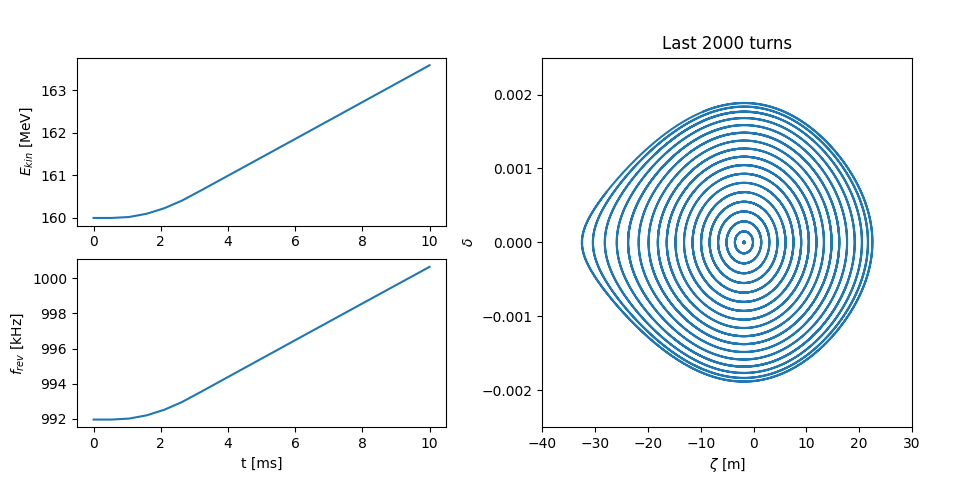

</details>

## Twiss

Xtrack provides a *twiss method* that can be used to obtain the lattice functions and other quantities.  
We will see how to obtain and tune chromaticities, slip factor, ...

We will use a pre-defined beamline: [twiss_line.json](twiss/twiss_line.json) taken from [here](https://github.com/xsuite/xtrack/blob/main/test_data/hllhc15_noerrors_nobb/line_and_particle.json)

> [!NOTE]
> The corresponding file is [twiss.py](twiss.py)
> 
> This is based on : https://xsuite.readthedocs.io/en/latest/twiss.html

> [!TIP]
> Remember to use `tw = line.twiss(method='4d')` if there is no RF in place!

<details>
<summary>Click here to see more!</summary>

### Access the information

We begin by importing the beamline and plot the 'standard' information we might want:  
tune, chromaticity, transition $\gamma_{tr}$, $\beta$ functions, 'closed orbit', Dispertion funcions.

After defining the line, we just run `tw = line.twiss()`  and all these are easily obtained.  
For *x* is simply: tune `tw.qx`, chromaticity `tw.dqx`, dispertion `tw.dx`, ...

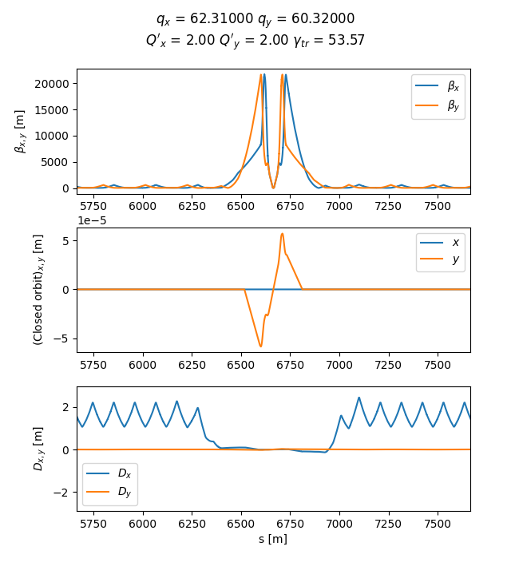

We can also see the whole table using `tw.show()` or do some more quaries:  
in simple cases we might want *scalar* quantities `tw['qx'] = tw.qx` or *columns* `tw['betx']`  
it is also possible to define additional columns with simple math expression like `tw.cols['betx dx/sqrt(betx)']`  
*a section of the ring* by name `tw.rows['ip5':'mqxfa.a1r5_exit']` or by position `tw.rows[300:305:'s']`

All the above can be combined in complex quaries like `tw.rows['ip1':'ip2'].rows['mqs.*b1'].cols['betx bety']`

### 4D option

If there are no RF cavities or they are switched off `line.twiss()` will fail.  
The work around is to use the 4D option as shown here:

```
# We consider a case in which all RF cavities are off
tab = line.get_table()
tab_cav = tab.rows[tab.element_type == 'Cavity']
for nn in tab_cav.name:
    line[nn].voltage = 0

# For this configuration, `line.twiss()` gives an error because the
# longitudinal motion is not stable.
# In this case, the '4d' method of `line.twiss()` can be used to compute the
# twiss parameters.

tw = line.twiss(method='4d')
```
</details>

## ...Upcoming

> [!NOTE]
> The corresponding file is [Upcoming.py](Upcoming.py)
> 
> This is based on : 

<details>
<summary>Click here to see more!</summary>


</details>
