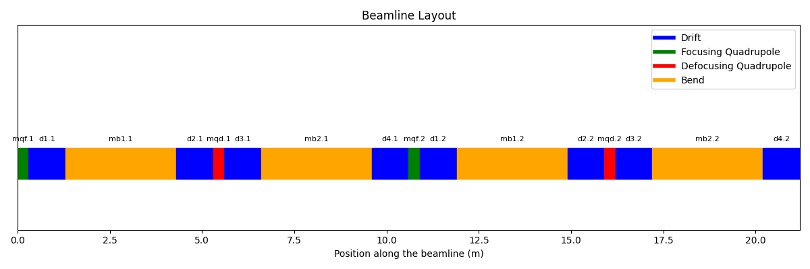

# X-Suite starter pack
As described on [x-suite website](https://xsuite.readthedocs.io/en/latest/):
*Xsuite is a collection python packages for the simulation of the beam dynamics in particle accelerators.*

This repo is a collection of examples (mostly copied from the x-suite documentation) developed to practice with this new tool. 

## Table of content
- [Install X-Suite or get a Docker](#install-x-suite) 
- [First working example](#first-working-example)
- [Describe a Line](#describe-a-line)

## Install X-Suite
X-Suite can be easily installed via `pip` but in case you prefer I have a dockerfile you can use.

For more information on Docker usage with Xsuite, visit [this Docker repository](https://github.com/b-vitali/Dockers).

This docker has some minimal tweeking to have a functioning jupyter notebook and other small things.
Most of the requirements for additional tools (MAD-X, Sixtracktools, PyHEADTAIL, ...) are already installed.

## First working example
Let's dive right in. The `basic_example.py` has the minimal functioning parts for a simple simulation
This code simulates the tracking of particles through a simple lattice using the x-suite library (Xtrack, Xobjects).
The purpose is to visualize the evolution in phase space (\( x, px \)) of a particle over multiple turns.

### Code Overview
The code is hevely commented so here I will just outline the steps, which are similar in every simulation
- Generate a *Line*
- Attach a reference particle
- Define on what the simulation will be running (CPU/GPU)
- Compute the *Twiss parameters*
- Simulate the particles for N turns
- Collect and plot the results

### Results
Collecting the tracking information at every turn we can follow the evolution in (\( x, px \))


## Describe a Line
Let's now move to [line_example_1.py](line_example_1.py)
Here we will see how to define, inspect, manipulate, and save/load a beamline model using the `xtrack`

### Defining a Line
A line can be defined in several ways:
- **Manually**: By creating individual beamline elements (e.g., `Quadrupole`, `Drift`, `Bend`) and adding them to the line.
- **Importing from MAD-X**: Using `xt.Line.from_madx_sequence()` to import a line from a MAD-X file.
- **Using a Sequence**: Defining the line through element positions and properties.

The line define manually in this example is shown here
```
pi = np.pi
lbend = 3
lquad = 0.3
elements = {
    'mqf.1': xt.Quadrupole(length=lquad, k1=0.1),
    'd1.1':  xt.Drift(length=1),
    'mb1.1': xt.Bend(length=lbend, k0=pi / 2 / lbend, h=pi / 2 / lbend),
    'd2.1':  xt.Drift(length=1),

    'mqd.1': xt.Quadrupole(length=lquad, k1=-0.7),
    'd3.1':  xt.Drift(length=1),
    'mb2.1': xt.Bend(length=lbend, k0=pi / 2 / lbend, h=pi / 2 / lbend),
    'd4.1':  xt.Drift(length=1),

    ...
}
```


### Inspecting a Line
`xtrack` provides methods to inspect line properties:
- **Element names**: Retrieve all the names of elements in the line (`line.element_names`).
- **Element objects**: Retrieve the actual element objects (`line.elements`).
- **Attributes extraction**: Extract specific attributes (e.g., length) across all elements (`line.attr['length']`).
- **Table view**: Generate a detailed table with information about each element (`line.get_table()`).

### Controlling Element Properties Using Variables
Variables and expressions can be used to control properties of elements:
- **Creating Variables**: Variables (`line.vars`) are created to control the integrated strengths (`k1l`) of quadrupoles.
- **Associating Variables with Elements**: Variables are linked to elements using references (`line.element_refs`). This allows changes in variables to automatically propagate to the corresponding element properties.
- **Global Variables**: Global variables (`line.vars['k1lf']` and `line.vars['k1ld']`) can be defined to control multiple quadrupoles simultaneously.

### Creating and Using Expressions
Expressions can be built using variables to create complex relationships:
- Variables can be combined using mathematical operations.
- Expressions update automatically when their dependencies change, maintaining consistency in the model.

### Saving and Loading a Line
`xtrack` allows saving a line to a JSON file or a dictionary:
- **Saving to JSON**:
    ```python
    line.to_json('line.json')
    ```

- **Loading from JSON**:
    ```python
    line_2 = xt.Line.from_json('line.json')
    ```

You can also save additional information within the dictionary:
```
dct = line.to_dict()
dct['my_additional_info'] = 'Some important information about this line I created'
with open('line.json', 'w') as fid:
    json.dump(dct, fid, cls=xo.JEncoder)

# Loading back
with open('line.json', 'r') as fid:
    loaded_dct = json.load(fid)
line_2 = xt.Line.from_dict(loaded_dct)
print(loaded_dct['my_additional_info'])
```