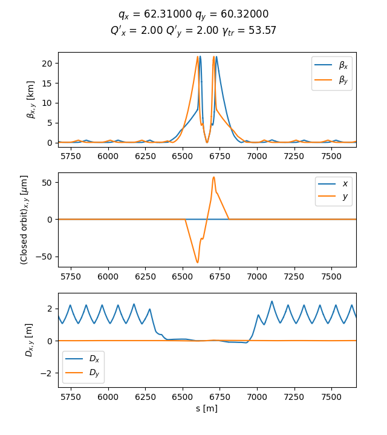

<!-- <div style="width: 830px"> -->

# X-Suite starter pack
As described on [x-suite website](https://xsuite.readthedocs.io/en/latest/):  
*Xsuite is a collection python packages for the simulation of the beam dynamics in particle accelerators.*

This repo is a collection of mostly pre-existing examples developed to practice with this new tool.  
When possible, I will point to the link of the original example/repo.

## Table of content
- [Install X-Suite or get a Docker](#install-x-suite) 
- [First working example](#first-working-example)
- [Describe a line](#describe-a-line)
- [Control a line](#control-a-line)
- [Build a ring](#build-a-ring)
- [Twiss](#twiss)
- [Match](#match)
- [Match multiple lines](#match-multiple-lines)
- [Acceleration](#acceleration)

## Install X-Suite
X-Suite can be easily installed via `pip` but in case you prefer I have a dockerfile you can use.

For more information on Docker usage with Xsuite, visit [this Docker repository](https://github.com/b-vitali/Dockers).

This docker has some minimal tweeking to have a functioning jupyter notebook and other small things.  
Most of the requirements for additional tools (MAD-X, Sixtracktools, PyHEADTAIL, ...) are already installed.

## First working example
This code simulates the tracking of particles through a simple lattice using the x-suite library.  
The purpose is to visualize the evolution in phase space \( x, px \) of a particle over multiple turns.

> [!NOTE]
> The corresponding file is [basic_example.py](basic_example.py)
> 
> This is based on : https://xsuite.readthedocs.io/en/latest/singlepart.html

<details>
<summary>Click here to see more!</summary>

### Code Overview
The code is hevely commented so here I will just outline the steps, which are similar in every simulation
- Generate a *Line*
- Attach a reference particle
- Define on what the simulation will be running (CPU/GPU)
- Compute the *Twiss parameters*
- Simulate the particles for N turns
- Collect and plot the results

Collecting the tracking information at every turn we can follow the evolution in \( x, px \):


</details>


## Describe a line
Clearly the first important step is to understand how to describe the beamline we wish to study.  
Here we will see how to define, inspect, manipulate, and save/load a beamline model using the `xtrack`.

> [!NOTE]
> The corresponding file is [line.py](line/line.py)
> 
> This is based on : https://xsuite.readthedocs.io/en/latest/line.html

> [!CAUTION]
> For whatever reason describing the line as `xt.Line` makes so `line.survey().plot()` doesn't work
> 
> I'm investigating what is going on

<details>
<summary>Click here to see more!</summary>

### Defining a Line
A line can be defined in several ways:
- **Manually**: Create individual beamline elements (`Quadrupole`, `Drift`, `Bend`) and adding them to the line.  
This is what we do for this example

```
    pi = np.pi
    lbend = 3
    lquad = 0.3
    elements = {
        'mqf.1': xt.Quadrupole(length=lquad, k1=0.1),
        'd1.1':  xt.Drift(length=1),
        'mb1.1': xt.Bend(length=lbend, k0=pi / 2 / lbend, h=pi / 2 / lbend),
        'd2.1':  xt.Drift(length=1),

        'mqd.1': xt.Quadrupole(length=lquad, k1=-0.7),
        'd3.1':  xt.Drift(length=1),
        'mb2.1': xt.Bend(length=lbend, k0=pi / 2 / lbend, h=pi / 2 / lbend),
        'd4.1':  xt.Drift(length=1),
        ...
    }
```

- **Importing from MAD-X**: Use `xt.Line.from_madx_sequence()` to import a line from a MAD-X file.  
    For example importing the MAD-X file taken from [here](https://github.com/xsuite/xtrack/blob/main/test_data/psb_chicane/psb_fb_lhc.str):

```
    from cpymad.madx import Madx
    mad = Madx()

    # Here the code is passed to MAD-X so it's actually Fortran
    mad.input('''
    call, file = './madx/psb.seq';
    call, file = './madx/psb_fb_lhc.str';

    beam, particle=PROTON, pc=0.5708301551893517;
    use, sequence=psb1;

    select,flag=error,clear;
    select,flag=error,pattern=bi1.bsw1l1.1*;
    ealign, dx=-0.0057;

    select,flag=error,clear;
    select,flag=error,pattern=bi1.bsw1l1.2*;
    select,flag=error,pattern=bi1.bsw1l1.3*;
    select,flag=error,pattern=bi1.bsw1l1.4*;
    ealign, dx=-0.0442;

    twiss;
    ''')

    line = xt.Line.from_madx_sequence(
    sequence=mad.sequence.psb1,
    allow_thick=True,
    enable_align_errors=True,
    deferred_expressions=True,
    )
```

- **Using a Sequence**: Define the line through element positions and properties.

```
    elements = {
    'quad': Multipole(length=0.3, knl=[0, +0.50]),
    'bend': Multipole(length=0.5, knl=[np.pi / 12], hxl=[np.pi / 12]),
    }

    sequences = {
        'arc': [Node(1.0, 'quad'), Node(4.0, 'bend', from_='quad')],
    }

    line = Line.from_sequence([
            Node( 0.0, 'arc'),
            Node(10.0, 'arc', name='section2'),
            Node( 3.0, Multipole(knl=[0, 0, 0.1]), from_='section2', name='sext'),
            Node( 3.0, 'quad', name='quad_5', from_='sext'),
        ], length=20,
        elements=elements, sequences=sequences,
        auto_reorder=True, copy_elements=False,
    )
```


### Inspecting a Line
`xtrack` provides methods to inspect line properties (see [here](https://github.com/xsuite/xtrack/blob/main/examples/toy_ring/004_inspect.py) for more):
- **Element names**: Retrieve all the names of elements in the line (`line.element_names`).
- **Element objects**: Retrieve the actual element objects (`line.elements`).
- **Attributes extraction**: Extract specific attributes (e.g., length) across all elements (`line.attr['length']`).
- **Table view**: Generate a detailed table with information about each element (`line.get_table()`).

```
# Quick access to an element and its attributes by name (line['mqf.1']) or index (line[0])
line['mqf.1'] # is Quadrupole(length=0.3, k1=0.1, ...)
line['mqf.1'].k1 # is 0.1
line['mqf.1'].length # is 0.3

# Tuple with all element names
line.element_names # is ('mqf.1', 'd1.1', 'mb1.1', 'd2.1', 'mqd.1', ...)

# Tuple with all element objects
line.elements # is (Quadrupole(length=0.3, k1=0.1, ...), Drift(length=1), ...)

# `line.attr[...]` can be used for efficient extraction of a given attribute for all elements
line.attr['length'] # is (0.3, 1, 3, 1, 0.3, 1, 3, 1, 0.3, 1, 3, 1, 0.3, 1, 3, 1)
line.attr['k1l'] # is ('0.03, 0.0, 0.0, 0.0, -0.21, 0.0, 0.0, 0.0, 0.03, ... )

# The list of all attributes can be found in
line.attr.keys() # is ('length', 'k1', 'k1l', 'k2', 'k2l', 'k3', 'k3l', 'k4', ... )

# `line.get_table()` can be used to get a table with information about the line elements
tab = line.get_table()
tab.show()

# Access to a single element of the table
tab['s', 'mb2.1'] # is 6.6

# Access to a single column of the table
tab['s'] # is [0.0, 0.3, 1.3, 4.3, 5.3, 5.6, 6.6, 9.6, 10.6, 10.9, 11.9, ...]

# Regular expressions can be used to select elements by name
tab.rows['mb.*']

...
```

### Saving and Loading a Line
`xtrack` allows saving a line to a JSON file or a dictionary:
- **Saving to JSON**:
    ```python
    line.to_json('line.json')
    ```

- **Loading from JSON**:
    ```python
    line_2 = xt.Line.from_json('line.json')
    ```

You can also save additional information within the dictionary:
```
dct = line.to_dict()
dct['my_additional_info'] = 'Some important information about this line I created'
with open('line.json', 'w') as fid:
    json.dump(dct, fid, cls=xo.JEncoder)

# Loading back
with open('line.json', 'r') as fid:
    loaded_dct = json.load(fid)
line_2 = xt.Line.from_dict(loaded_dct)
print(loaded_dct['my_additional_info'])
```

### Adding elements
Taking the previous *line*, we can add sextupoles right after the quadrupoles via `line.insert_element()`


### Slicing
To improve the simulation it is quite common to *slice* the elements in smaller chunks
This can be done in various ways using different `slicing_strategies`
```
line.slice_thick_elements(
    slicing_strategies=[
        # Slicing with thin elements
        xt.Strategy(slicing=xt.Teapot(1)),                              # Default applied to all elements
        xt.Strategy(slicing=xt.Uniform(2), element_type=xt.Bend),       # Selection by element type
        xt.Strategy(slicing=xt.Teapot(3), element_type=xt.Quadrupole),  # Selection by element type
        xt.Strategy(slicing=xt.Teapot(4), name='mb1.*'),                # Selection by name pattern
        # Slicing with thick elements
        xt.Strategy(slicing=xt.Uniform(2, mode='thick'), name='mqf.*'), # Selection by name pattern
        # Do not slice (leave untouched)
        xt.Strategy(slicing=None, name='mqd.1') # (7) Selection by name
    ])
```


</details>

## Control a line
Clearly it is not feaseble to chage values by hand and re-save a line.json.  
There are few options to ease the control over the beamlines once created.

> [!NOTE]
> The corresponding file is [line_controls.py](line/line_controls.py)
> 
> This is based on : https://xsuite.readthedocs.io/en/latest/line.html

> [!IMPORTANT]
> This section is a bit rough to read, I know...
>  
> It is very important so some patience is needed

<details>
<summary>Click here to see more!</summary>

### Controlling elements using *variables*
Variables and expressions can be used to control properties of elements:
- **Creating Variables**: Variables (`line.vars`) are created to control the integrated strengths (`k1l`) of quadrupoles.
- **Associating Variables with Elements**: Variables are linked to elements using references (`line.element_refs`). This allows changes in variables to automatically propagate to the corresponding element properties.
- **Global Variables**: Global variables (`line.vars['k1lf']` and `line.vars['k1ld']`) can be defined to control multiple quadrupoles simultaneously.

```
# For each quadrupole we create a variable controlling its integrated strength.
# Expressions can be associated to any beam element property, using the `element_refs`:
line.vars['k1l.qf.1'] = 0
line.element_refs['mqf.1'].k1 = line.vars['k1l.qf.1'] / lquad
line.vars['k1l.qd.1'] = 0
line.element_refs['mqd.1'].k1 = line.vars['k1l.qd.1'] / lquad
line.vars['k1l.qf.2'] = 0
line.element_refs['mqf.2'].k1 = line.vars['k1l.qf.2'] / lquad
line.vars['k1l.qd.2'] = 0
line.element_refs['mqd.2'].k1 = line.vars['k1l.qd.2'] / lquad

# When a variable is changed, the corresponding element property is automatically
# updated:
line.vars['k1l.qf.1'] = 0.1
line['mqf.1'].k1 # is 0.333, i.e. 0.1 / lquad

# We can create a variable controlling the integrated strength of the two focusing quadrupoles
line.vars['k1lf'] = 0.1
line.vars['k1l.qf.1'] = line.vars['k1lf']
line.vars['k1l.qf.2'] = line.vars['k1lf']
# and a variable controlling the integrated strength of the two defocusing quadrupoles
line.vars['k1ld'] = -0.7
line.vars['k1l.qd.1'] = line.vars['k1ld']
line.vars['k1l.qd.2'] = line.vars['k1ld']

# Changes on the controlling variable are propagated to the controlled ones 
# and also to the corresponding element properties
line.vars['k1lf'] = 0.2
line.vars['k1l.qf.1']._get_value() # is 0.2
line.vars['k1l.qf.2']._get_value() # is 0.2
line['mqf.1'].k1 # is 0.666, i.e. 0.2 / lquad
line['mqf.2'].k1 # is 0.666, i.e. 0.2 / lquad

# The `_info()` method of a variable provides information on the existing relations
# between the variables. For example:
line.vars['k1l.qf.1']._info()
# prints:
##  vars['k1l.qf.1']._get_value()
#   vars['k1l.qf.1'] = 0.2
#
##  vars['k1l.qf.1']._expr
#   vars['k1l.qf.1'] = vars['k1lf']
#
##  vars['k1l.qf.1']._expr._get_dependencies()
#   vars['k1lf'] = 0.2
#
##  vars['k1l.qf.1']._find_dependant_targets()
#   element_refs['mqf.1'].k1
```

### More complex controls with *expressions*
Expressions can be built using variables to create complex relationships:
- Variables can be combined using mathematical operations.
- Expressions update automatically when their dependencies change, maintaining consistency in the model.

```
# Expressions can include multiple variables and mathematical operations. 
# For example line.vars['a'] = 3 * line.functions.sqrt(line.vars['k1lf']) + 2 * line.vars['k1ld']

# As seen above, line.vars['varname'] returns a reference object that
# can be used to build further references, or to inspect its properties.
# To get the current value of the variable, one needs to use `._get_value()`
# For quick access to the current value of a variable, one can use the `line.varval` (or `line.vv`)
line.varval['k1lf'] # is 0.2
line.vv['k1lf']     # is 0.2

# Note an important difference when using `line.vars` or `line.varval` in building
# expressions. For example:
line.vars['a'] = 3.
line.vars['b'] = 2 * line.vars['a']

# In this case the reference to the quantity `line.vars['a']` is stored in the expression, 
# and the value of `line.vars['b']` is updated when `line.vars['a']` changes:
line.vars['a'] = 4.
line.vv['b'] # is 8.

# On the contrary, when using `line.varval` or `line.vv` in building expressions,
# the current value of the variable is stored in the expression:
line.vv['a'] = 3.
line.vv['b'] = 2 * line.vv['a']
line.vv['b'] # is 6.
line.vv['a'] = 4.
line.vv['b'] # is still 6.

# The `line.vars.get_table()` returns a table with the value of all the existing variables:
line.vars.get_table()
```
</details>


## Build a ring

Let's now try and build a proper ring, matched and with FODO structure.  
Once this is done we can add an insertion for an *experiment*.

> [!NOTE]
> The corresponding file is [ring.py](ring/ring.py)
> 
> This is based on : https://github.com/xsuite/tutorial_lattice_design/blob/main/notebook_00_ring.ipynb

<details>
<summary>Click here to see more!</summary>

### Build a FODO 

First step is defining the variables and the magnets and mount them in a *half cell*.

To make it a full FODO is then it's quite simple, mirroring the half cell.
```
# Define the full cell by mirroring the half-cell
cell = env.new_line(components=[
    env.new('start', xt.Marker),  # Start marker
    -halfcell,                    # Mirror the first half of the cell
    halfcell,                     # Add the second half of the cell
    env.new('end', xt.Marker),    # End marker
])
```


At this point we can *match* and see the resulting *twiss*
```
# Perform phase advance matching (setting the tunes to specific values)
opt = cell.match(
    solve=False,  # Do not solve immediately; we'll inspect before solving
    method='4d',  # 4D matching method
    vary=xt.VaryList(['kqf', 'kqd'], step=1e-5),  # Vary the strengths of the focusing and defocusing quadrupoles
    targets=xt.TargetSet(
        qx=0.333333,  # Target horizontal tune (fractional part of betatron oscillation)
        qy=0.333333,  # Target vertical tune
    ))
```


### Make a ring

We first define a *half straight section* and build with it a *whole straight section*

Then we can mount multiple FODO and straight sections in a *full ring* with some math

```
# Assemble a ring
arc = 3 * cell
straight_section = 2*cell_ss
ring = 3 * (arc + straight_section)
ring.survey().plot()
```


### Create an insertion

We want now to make some space in this ring for an experiment

We first define a region of 40m with round beta functions

Create a *half section* and match the optics to the FODO

The last step it to make a *whole section* and build the ring


### Finished lattice

We place the insertion with `ring_2 = 2 * (arc + straight_section) + arc + insertion`

Now we can finally see our results!


</details>


## Twiss

Xtrack provides a *twiss method* that can be used to obtain the lattice functions and other quantities.  
We will see how to obtain and tune chromaticities, slip factor, ...

> [!NOTE]
> The corresponding file is [twiss.py](twiss.py)
> 
> This is based on : https://xsuite.readthedocs.io/en/latest/twiss.html
>
> We will use a pre-defined beamline: [twiss_line.json](twiss/twiss_line.json) taken from [here](https://github.com/xsuite/xtrack/blob/main/test_data/hllhc15_noerrors_nobb/line_and_particle.json)

> [!TIP]
> Remember to use `tw = line.twiss(method='4d')` if there is no RF in place!

<details>
<summary>Click here to see more!</summary>

### Access the information

We begin by importing the beamline and plot the 'standard' information we might want:  
tune, chromaticity, transition $\gamma_{tr}$, $\beta$ functions, 'closed orbit', Dispertion funcions.

After defining the line, we just run `tw = line.twiss()`  and all these are easily obtained.  
For *x* is simply: tune `tw.qx`, chromaticity `tw.dqx`, dispertion `tw.dx`, ...


We can also see the whole table using `tw.show()` or do some more quaries:  
in simple cases we might want *scalar* quantities `tw['qx'] = tw.qx` or *columns* `tw['betx']`  
it is also possible to define additional columns with simple math expression like `tw.cols['betx dx/sqrt(betx)']`  
*a section of the ring* by name `tw.rows['ip5':'mqxfa.a1r5_exit']` or by position `tw.rows[300:305:'s']`

All can be combined in complex quaries like `tw.rows['ip1':'ip2'].rows['mqs.*b1'].cols['betx bety']`



To compute the beam size we have to provide the emittances to `tw.get_beam_covariance(...)`.  
The resulting table can be accessed, for example, by row `beam_sizes.rows['ip.?'].show()`.

```
# Compute beam sizes
beam_sizes = tw.get_beam_covariance(nemitt_x=nemitt_x, nemitt_y=nemitt_y, gemitt_zeta=gemitt_zeta)

# Inspect beam sizes (table can be accessed similarly to twiss tables)
beam_sizes.rows['ip.?'].show()
# prints
#
# name                       s     sigma_x     sigma_y sigma_zeta    sigma_px ...
# ip3                        0 0.000226516 0.000270642    0.19694 4.35287e-06
# ip4                  3332.28 0.000281326 0.000320321   0.196941 1.30435e-06
# ip5                  6664.57  7.0898e-06 7.08975e-06    0.19694  4.7265e-05
# ip6                  9997.01 0.000314392 0.000248136   0.196939 1.61401e-06
...

# All covariances are computed including those from linear coupling
beam_sizes.keys()
# is:
#
# ['s', 'name', 'sigma_x', 'sigma_y', 'sigma_zeta', 'sigma_px', 'sigma_py',
# 'sigma_pzeta', 'Sigma', 'Sigma11', 'Sigma12', 'Sigma13', 'Sigma14', 'Sigma15',
# 'Sigma16', 'Sigma21', 'Sigma22', 'Sigma23', 'Sigma24', 'Sigma25', 'Sigma26',
# 'Sigma31', 'Sigma32', 'Sigma33', 'Sigma34', 'Sigma41', 'Sigma42', 'Sigma43',
# 'Sigma44', 'Sigma51', 'Sigma52'])
```


### Reverse
The `reverse` flag enables the retrieval of the Twiss parameters in a counter-rotating reference frame. 

When `reverse` is set to `True`, the following changes occur:
- The order of the elements is reversed.
- The zero points for `s` and the phase advances are adjusted to the new starting point.
- The signs of `s'` and `x'` are inverted, while the sign of `y` remains unchanged.


### Particles physical/normalized coordinates

Twiss can be also used to convert particle physical coordinates into normalized coordinates.

```
# Generate some particles with known normalized coordinates
particles = line.build_particles(
    nemitt_x=2.5e-6, nemitt_y=1e-6,
    x_norm=[-1, 0, 0.5], y_norm=[0.3, -0.2, 0.2],
    px_norm=[0.1, 0.2, 0.3], py_norm=[0.5, 0.6, 0.8],
    zeta=[0, 0.1, -0.1], delta=[1e-4, 0., -1e-4])

# Inspect physical coordinates
tab = particles.get_table()
tab.show()
# prints
#
# Table: 3 rows, 17 cols
# particle_id s            x           px            y          py zeta   delta chi ...
#           0 0 -0.000253245  3.33271e-06  5.10063e-05 1.00661e-06    0  0.0001   1
#           1 0 -2.06127e-09  3.32087e-07 -3.42343e-05 5.59114e-08  0.1       0   1
#           2 0  0.000152331 -7.62878e-07  3.45785e-05  1.0462e-06 -0.1 -0.0001   1

# Use twiss to compute normalized coordinates
norm_coord = tw.get_normalized_coordinates(particles, nemitt_x=2.5e-6, nemitt_y=1e-6)

# Inspect normalized coordinates
norm_coord.show()
#
# Table: 3 rows, 8 cols
# particle_id at_element       x_norm px_norm y_norm py_norm   zeta_norm  pzeta_norm
#           0          0           -1     0.1    0.3     0.5 1.06651e-07  0.00313799
#           1          0 -1.59607e-20     0.2   -0.2     0.6  0.00318676 1.12046e-05
#           2          0          0.5     0.3    0.2     0.8  -0.0031868  -0.0031492
```

### 4D option and 'partial twiss'

If there are no RF cavities or they are switched off `line.twiss()` will fail.  
The work around is to use the 4D option as shown here:

```
# We consider a case in which all RF cavities are off
tab = line.get_table()
tab_cav = tab.rows[tab.element_type == 'Cavity']
for nn in tab_cav.name:
    line[nn].voltage = 0

# For this configuration, `line.twiss()` gives an error because the
# longitudinal motion is not stable.
# In this case, the '4d' method of `line.twiss()` can be used to compute the
# twiss parameters.

tw = line.twiss(method='4d')
```

### Portion of the beamline
The twiss method can also be used to find the periodic solution for a portion of a beam line.  
We must simply specify *start* and *end* plus use the `periodic` flag.
```
tw = line.twiss(method='4d', start='mq.14r6.b1', end='mq.16r6.b1', init='periodic')
```

### Off momentum 

The `4d` option can be used to study the dependences from the momentum offset.  
This is done with `line.twiss(method='4d', delta0=delta)`.


### Initial conditions

It is possible to provide, by hand or with a previous twiss, initial conditions.

```
# Twiss over a range with user-defined initial conditions (at start)
tw1 = line.twiss(start='ip5', end='mb.c24r5.b1',
                betx=0.15, bety=0.15, py=1e-6)


# Twiss over a range with user-defined initial conditions at end
tw2 = line.twiss(start='ip5', end='mb.c24r5.b1', init_at=xt.END,
                alfx=3.50482, betx=131.189, alfy=-0.677173, bety=40.7318,
                dx=1.22515, dpx=-0.0169647)

# Twiss over a range with user-defined initial conditions at arbitrary location
tw3 = line.twiss(start='ip5', end='mb.c24r5.b1', init_at='mb.c14r5.b1',
                 alfx=-0.437695, betx=31.8512, alfy=-6.73282, bety=450.454,
                 dx=1.22606, dpx=-0.0169647)

# Initial conditions can also be taken from an existing twiss table
tw4 = line.twiss(start='ip5', end='mb.c24r5.b1', init_at='mb.c14r5.b1',
                 init=tw_p)

# `TwissInit` object can be extracted from a twiss table and used as initial conditions
tw_init = tw_p.get_twiss_init('mb.c14r5.b1',)
tw5 = line.twiss(start='ip5', end='mb.c24r5.b1', init=tw_init)
```

The results for `tw5` in this case are the one shown here


### Default behaviour

It is possible to define new 'default' behaviour for `line.twiss()`

For example we might want to define `4d` the default `method`

```
# Inspect twiss defaults
line.twiss_default # is {}

# Set some twiss defaults
line.twiss_default['method'] = '4d'
line.twiss_default['reverse'] = True

# Twiss (defaults redefined)
tw_b = line.twiss()
tw_b.method # is '4d'
tw_b.reference_frame # is 'reverse'
line.twiss_default # now is {'method': '4d', 'reverse': True}

# Reset twiss defaults
line.twiss_default.clear()
line.twiss_default # now is {}
```
</details>

## Match
To obtain desired values in the twiss results we can adjust `knobs` attached to the `line`.  
This is done via the numerical optimizer `match` method

> [!NOTE]
> The corresponding file is [match.py](match/match.py)
> 
> This is based on : https://xsuite.readthedocs.io/en/latest/match.html
>
> We will use a pre-defined beamline: [match_line.json](match/match_line.json) taken from [here](https://github.com/xsuite/xtrack/blob/main/test_data/hllhc15_thick/lhc_thick_with_knobs.json)

<details>
<summary>Click here to see more!</summary>

### Basic usage

To use the `xtrack.Line.match()` method a set of `Vary` and `Target` objects are defined.  
The first are the *knobs* that will be changed to match the defined target.  
The following code shows how to match the tunes and chromaticities of a ring.

```
# Match tunes and chromaticities to assigned values
opt = line.match(
    # Matching method used; in this case, a 4-dimensional optimization
    method='4d',  
    vary=[
        # Quadrupole strengths to be varied with steps 1e-8
        xt.VaryList(['kqtf.b1', 'kqtd.b1'], step=1e-8, tag='quad'),
        # Sextupole strengths to be varied with steps 1e-4 within [-0.1, 0.1] 
        xt.VaryList(['ksf.b1', 'ksd.b1'], step=1e-4, limits=[-0.1, 0.1], tag='sext'),  
    ],
    targets=[
        # Target tunes with a tolerance of 1e-6
        xt.TargetSet(qx=62.315, qy=60.325, tol=1e-6, tag='tune'), 
        # Target chromaticities with a tolerance of 0.01 
        xt.TargetSet(dqx=10.0, dqy=12.0, tol=0.01, tag='chrom'),  
    ])

# Get knobs values before optimization
knobs_before_match = opt.get_knob_values(iteration=0)
# contains: {'kqtf.b1': 0, 'kqtd.b1': 0, 'ksf.b1': 0, 'ksd.b1': 0}

# Get knobs values after optimization
knobs_after_match = opt.get_knob_values()
# contains: {'kqtf.b1': 4.27163e-05,  'kqtd.b1': -4.27199e-05,
#            'ksf.b1': 0.0118965, 'ksd.b1': -0.0232137}
```


### Match in a specific location

The match can be performed on a specific portion/position of the beamline.  
This is done providing `xt.START` and `xt.EDN`

We want to obtain the following conditions in different sections:
- mq.30l8.b1    : betx=1, bety=1, y=0, py=0
- mb.b28l8.b1   : betx=1, bety=1, y=3e-3, py=0
- mq.23l8.b1    : betx=1, bety=1, y=0, py=0

We use one of these as 'start' and the other two as 'target'.  
The result in this case is the same.

```
opt = line.match(
    start='mq.30l8.b1', end='mq.23l8.b1',
    init_at=xt.START, betx=1, bety=1, y=0, py=0, # <-- conditions at start
    vary=xt.VaryList(['acbv30.l8b1', 'acbv28.l8b1', 'acbv26.l8b1', 'acbv24.l8b1'],
                    step=1e-10, limits=[-1e-3, 1e-3]),
    targets = [
        xt.TargetSet(y=3e-3, py=0, at='mb.b28l8.b1'),
        xt.TargetSet(y=0, py=0, at=xt.END)
    ])

opt = line.match(
    start='mq.30l8.b1', end='mq.23l8.b1',
    init_at=xt.END, betx=1, bety=1, y=0, py=0, # <-- conditions at end
    vary=xt.VaryList(['acbv30.l8b1', 'acbv28.l8b1', 'acbv26.l8b1', 'acbv24.l8b1'],
                    step=1e-10, limits=[-1e-3, 1e-3]),
    targets = [
        xt.TargetSet(y=3e-3, py=0, at='mb.b28l8.b1'),
        xt.TargetSet(y=0, py=0, at=xt.START)
    ])

opt = line.match(
    start='mq.30l8.b1', end='mq.23l8.b1',
    init_at='mb.b28l8.b1', betx=1, bety=1, y=3e-3, py=0, # <-- conditions inside the range
    vary=xt.VaryList(['acbv30.l8b1', 'acbv28.l8b1', 'acbv26.l8b1', 'acbv24.l8b1'],
                    step=1e-10, limits=[-1e-3, 1e-3]),
    targets = [
        xt.TargetSet(y=0, py=0, at=xt.START),
        xt.TargetSet(y=0, py=0, at=xt.END)
    ])
```


### Match with twiss
We can define the boundary or the target also with an existing `line.twiss()`.  
The result of this example is the same as the previous pragraph.

```
tw0 = line.twiss(method='4d')
opt = line.match(
    start='mq.30l8.b1', end='mq.23l8.b1',
    init=tw0, init_at=xt.END, # <-- Boundary conditions from table
    vary=xt.VaryList(['acbv30.l8b1', 'acbv28.l8b1', 'acbv26.l8b1', 'acbv24.l8b1'],
                    step=1e-10, limits=[-1e-3, 1e-3]),
    targets = [
        xt.TargetSet(y=3e-3, py=0, at='mb.b28l8.b1'),
        xt.TargetSet(['y', 'py'], value=tw0, at=xt.START) # <-- Target from table
    ])
```
</details>

## Match multiple lines
What if we have multiple lines to match?  
And what if we need more flexibility?

> [!NOTE]
> The corresponding file is [match.py](match/match_multiplelines.py)
> 
> This is based on : https://xsuite.readthedocs.io/en/latest/match.html
>
> We will use a pre-defined beamline: [match_collider_line.json](match/match_collider_line.json) taken from [here](https://github.com/xsuite/xtrack/blob/main/test_data/hllhc15_thick/hllhc15_collider_thick.json)

> [!TIP]
> Remember *callables* and *inequalities* to have more flexibility when matching!

<details>
<summary>Click here to see more!</summary>


### Basics of multiple lines matching
The match method can also be used to match multiple lines at the same time.  
In this example we match orbit bumps in the two beams of a collider,  
the aim is to obtain a given crossing angle between the two beams.  
NB: Some of the used dipole magnets are shared between the two beams.

```
opt = collider.match(
    lines=['lhcb1', 'lhcb2'],
    start=['e.ds.l5.b1', 'e.ds.l5.b2'],
    end=['s.ds.r5.b1', 's.ds.r5.b2'],
    init=tw0,
    vary=xt.VaryList([
        'acbxv1.r5', 'acbxv1.l5', # <-- common elements
        'acbyvs4.l5b1', 'acbrdv4.r5b1', 'acbcv5.l5b1', # <-- b1
        'acbyvs4.l5b2', 'acbrdv4.r5b2', 'acbcv5.r5b2', # <-- b2
        ],
        step=1e-10, limits=[-1e-3, 1e-3]),
    targets = [
        xt.TargetSet(y=0, py=10e-6, at='ip5', line='lhcb1'),
        xt.TargetSet(y=0, py=-10e-6, at='ip5', line='lhcb2'),
        xt.TargetSet(y=0, py=0, at=xt.END, line='lhcb1'),
        xt.TargetSet(y=0, py=0, at=xt.END, line='lhcb2')
    ])
```


### Callables and Inequalities
In xtrack, *callables* and *inequalities* are ways to define matching targets.  
Their use allows matching of conditions involving multiple beams or parameters.
They are more flexible ways, beyond simple value matching.

1. Callable: is a function that returns a value based on the current state.  
This allows for complex conditions based on multiple parameters.  
Example: Ensures the sum of angles (py) of lhcb1 and lhcb2 at ip5 is zero:  
`xt.Target(lambda tw: tw.lhcb1['py', 'ip5'] + tw.lhcb2['py', 'ip5'], value=0)`  

2. Inequality: set upper or lower bounds for parameters, allowing a range.  
Example: Specifies that py for lhcb1 at ip5 must be between 9e-6 and 11e-6:
`xt.Target('py', xt.GreaterThan(9e-6), at='ip5', line='lhcb1')`  
`xt.Target('py', xt.LessThan(11e-6), at='ip5', line='lhcb1')`  

```
opt = collider.match(
    lines=['lhcb1', 'lhcb2'],
    start=['e.ds.l5.b1', 'e.ds.l5.b2'],
    end=['s.ds.r5.b1', 's.ds.r5.b2'],
    init=tw0,
    vary=xt.VaryList([
        'acbxv1.r5', 'acbxv1.l5', # <-- common elements
        'acbyvs4.l5b1', 'acbrdv4.r5b1', 'acbcv5.l5b1', # <-- b1
        'acbyvs4.l5b2', 'acbrdv4.r5b2', 'acbcv5.r5b2', # <-- b2
        ],
        step=1e-10, limits=[-1e-3, 1e-3]),
    targets = [
        xt.Target(y=0, at='ip5', line='lhcb1'),
        xt.Target('py', xt.GreaterThan(9e-6), at='ip5', line='lhcb1'), # <-- inequality
        xt.Target('py', xt.LessThan(  11e-6), at='ip5', line='lhcb1'), # <-- inequality
        xt.Target(y=0, at='ip5', line='lhcb2'),
        xt.Target(
            lambda tw: tw.lhcb1['py', 'ip5'] + tw.lhcb2['py', 'ip5'], value=0), # <-- callable
        xt.TargetSet(y=0, py=0, at=xt.END, line='lhcb1'),
        xt.TargetSet(y=0, py=0, at=xt.END, line='lhcb2')
    ])
opt.target_status()
```

The resulting plot is the same as in the previous paragraph.

</details>

## Acceleration
Let's see what happens when we rump up the energy of the particles

> [!NOTE]
> The corresponding file is [acceleration.py](acceleration/acceleration.py)
> 
> This is based on : https://github.com/xsuite/xtrack/blob/main/examples/acceleration/001_energy_ramp.py
>
> We will use a pre-defined beamline: [acceleration_line.json](acceleration/acceleration_line.json) taken from [here](https://github.com/xsuite/xtrack/blob/main/test_data/psb_injection/line_and_particle.json)


> [!WARNING]
> Work in progress

<details>
<summary>Click here to see more!</summary>

### Line and intended ramp-up

We start by importing a pre-existing beamline [acceleration_line.json](acceleration/acceleration_line.json)


We then define how we want to ramp-up the energy

```
# User-defined energy ramp: time values [s] and corresponding kinetic energies [GeV]
t_s = np.array([0., 0.0006, 0.0008, 0.001 , 0.0012, 0.0014, 0.0016, 0.0018,
                0.002 , 0.0022, 0.0024, 0.0026, 0.0028, 0.003, 0.01])

E_kin_GeV = np.array([0.16000000,0.16000000,
    0.16000437, 0.16001673, 0.16003748, 0.16006596, 0.16010243, 0.16014637,
    0.16019791, 0.16025666, 0.16032262, 0.16039552, 0.16047524, 0.16056165,
    0.163586])

# Attach the energy program to the line to define how the kinetic energy evolves over time
line.energy_program = xt.EnergyProgram(
    t_s=t_s,                            # Array of time points [s]
    kinetic_energy0=E_kin_GeV * 1e9     # Corresponding kinetic energies [eV]
)
```

### Propagate the ramp-up to the elements

Now we need to tell te elements in the line to follow the ramp-up we created

```

# Setup the RF cavity frequency to stay on the second harmonic of the revolution frequency
t_rf = np.linspace(0, 3e-3, 100)                    # Time samples for the frequency program (in seconds)
f_rev = line.energy_program.get_frev_at_t_s(t_rf)   # Get revolution frequency for each time sample
h_rf = 2                                            # Harmonic number
f_rf = h_rf * f_rev                                 # Calculate RF frequency as harmonic number times revolution frequency

# Build a piecewise linear function using the time and frequency samples and link it to the RF cavity
line.functions['fun_f_rf'] = xt.FunctionPieceWiseLinear(x=t_rf, y=f_rf)
line.element_refs['br.c02'].frequency = line.functions['fun_f_rf'](
                                                        line.vars['t_turn_s']) # Assign the RF frequency function

# Setup the voltage and phase lag of the RF cavity
line.element_refs['br.c02'].voltage = 3000  # Set the RF cavity voltage [V]
line.element_refs['br.c02'].lag = 0         # Set the phase lag (in degrees, below transition energy)

# When setting the line variable 't_turn_s', the reference energy and the RF frequency are updated automatically
line.vars['t_turn_s'] = 0
line.particle_ref.kinetic_energy0   # Kinetic energy should be 160.00000 MeV
line['br.c02'].frequency            # RF frequency should be 1983931.935 Hz

line.vars['t_turn_s'] = 3e-3
line.particle_ref.kinetic_energy0   # Kinetic energy updates to 160.56165 MeV
line['br.c02'].frequency            # RF frequency updates to 1986669.0559674294 Hz

# Reset to zero for tracking (prepare initial state)
line.vars['t_turn_s'] = 0

# Track a few particles to visualize the longitudinal phase space
p_test = line.build_particles(x_norm=0, zeta=np.linspace(0, line.get_length(), 101))

# Enable time-dependent variables (automatically update variables like 't_turn_s' at each turn)
line.enable_time_dependent_vars = True

# Track particles for 9000 turns and record data, with progress tracking enabled
line.track(p_test, num_turns=9000, turn_by_turn_monitor=True, with_progress=True)
mon = line.record_last_track
```


</details>

## ...Upcoming

> [!NOTE]
> The corresponding file is [Upcoming.py](Upcoming.py)
> 
> This is based on : 

<details>
<summary>Click here to see more!</summary>


</details>
